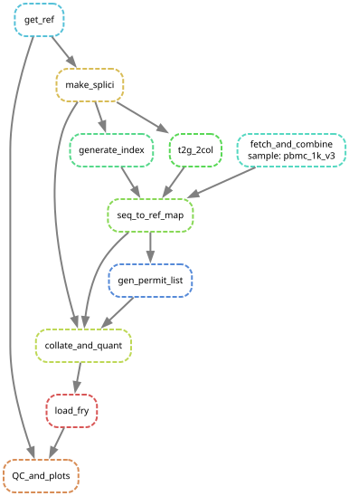
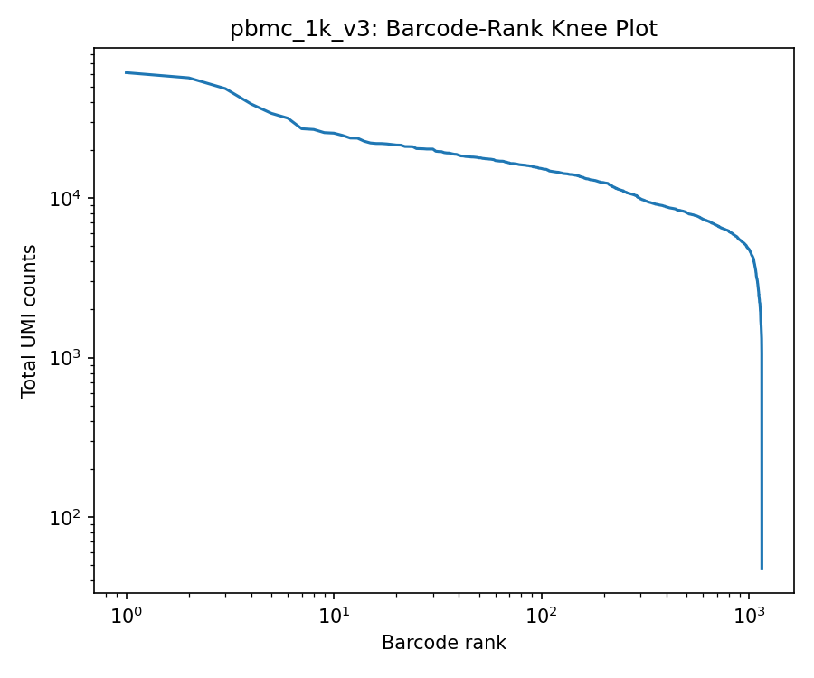
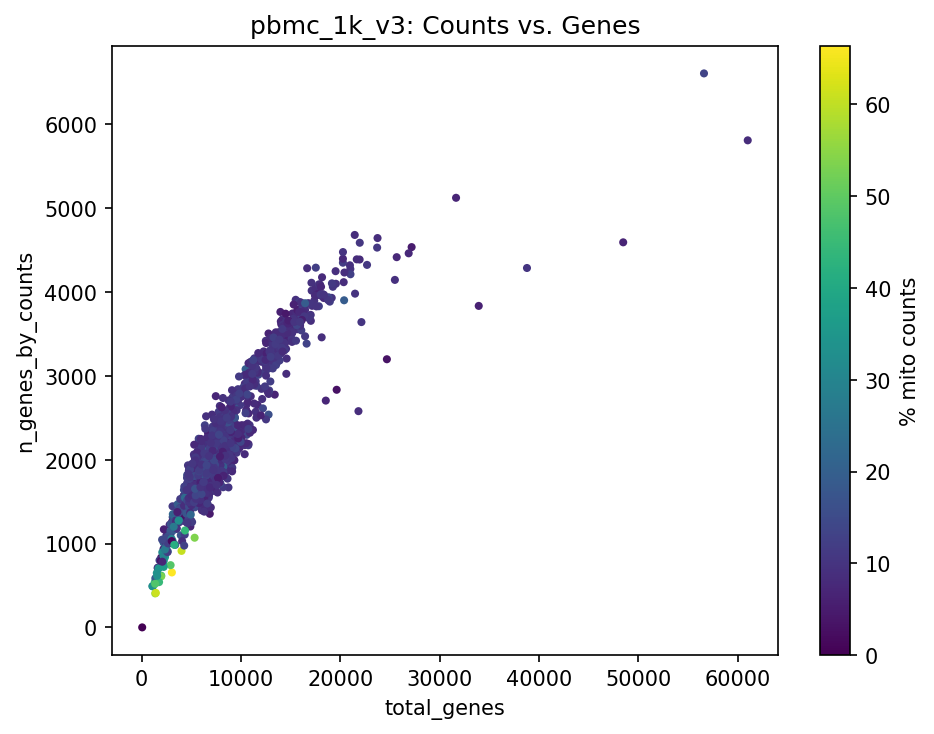

# scRNA-seq Quantitative Pipeline

This is a Snakemake port of an HPC-based `alevin-fry` single-cell RNA-seq lab workflow, reimplemented to run locally and reproducibly on 10x Chromium data. The pipeline runs end-to-end, from downloading a given dataset, to mapping with salmon, and cell-barcode/UMI resolution and quantification with `alevin-fry`. As implemented, the workflow is demonstrated on the 10x Genomics "1k PBMCs from a Healthy Donor" dataset.



## Quickstart Guide

Before running the pipeline, all the needed packages must be installed. Using the provided `env.yml`, a Conda environment can be created and activated as follows.

```bash
conda env create -f env.yml
conda activate alevin
```

To run the pipeline without any changes, the `snakemake --cores <number of CPU cores> <target>` command is used, where `<target>` is the output for a specific Snakemake rule. For example, `snakemake --cores 4 plots/pbmc_1k_v3/knee.png` will run the full pipeline on 4 CPU cores. It is worth noting that, as currently implemented, this command will download the whole 10x Genomics "1k PBMCs from a Healthy Donor" dataset and provide quantification and quality control metrics, so expect the run to take some time. 

Additional datasets can be downloaded and run on the pipeline via definition in the `config.yaml` file. To do so, add the name of the new dataset to the parent `samples:` list with a child `tar:` field pointing to the download URL of the needed tarball. If the needed dataset cannot be downloaded via a tarball, download the data manually and skip the `get_ref` rule while matching the file structure expected by the `fetch_and_combine` rule.

Due to the size of certain datasets, including the demonstration dataset used here, we recommend staging the data download before running the rest of the pipeline. Doing so ensures that if an error were to occur during the local computational phases, the data downloaded would not be marked as incomplete by Snakemake and, therefore, would not require a re-download of the dataset. In practice, we run the following.

```bash
snakemake --cores 4 data/ref/genome.fa data/reads/pbmc_1k_v3_R1.fastq.gz    # Stages the download
snakemake --cores 4 plots/pbmc_1k_v3/knee.png   # Runs the rest of the pipeline
```

### Expected Output

If a complete run has been successfully executed, multiple new folders would have been created. These include: `alevin-output`, `anndata`, `data`, and `plots`. The `alevin-output` folder will include the counts, mapping, and quantification folders generated by the `alevin-fry` pipeline. The `anndata` folder will contain the generated `anndata` object as a `h5ad` file. The `data` folder will include the downloaded dataset while the `plots` folder contains the quality control plots created by the pipeline.

Below we include the plots generated by the demonstration dataset.



The knee plot displays the total UMI counts vs the barcode rank. It can be noted that the sharp drop-off followed by no tail confirms clean separation between real cells and empty droplets, indicating that the `generate_permit_list` step correctly filtered the ambient barcodes.



The scatter plot displays the number of counts vs. total genes with points colored by the percentage of mitochondrial counts present. Some outliers are present with high counts and gene numbers, indicating that these are likely doublets while the low count, high mitochondrial cells are likely stressed or dying. These should be noted and considered during the analysis phase.

## Citations and Attribution
This pipeline is a reimplementation of a workflow I worked with in Bacher Lab. Significant changes were made to improve reproducibility and downstream analysis.

He, D., Zakeri, M., Sarkar, H., Soneson, C., Srivastava, A., and Patro, R. Alevin-fry unlocks rapid, accurate and memory-frugal quantification of single-cell RNA-seq data. Nat Methods 19, 316–322 (2022). https://doi.org/10.1038/s41592-022-01408-3

Patro R, Duggal G, Love MI, Irizarry RA, Kingsford C. Salmon provides fast and bias-aware quantification of transcript expression. Nat Methods. 2017 Apr;14(4):417-419. doi: 10.1038/nmeth.4197. Epub 2017 Mar 6. PMID: 28263959; PMCID: PMC5600148.

He, D., Zakeri, M., Sarkar, H. et al. Alevin-fry unlocks rapid, accurate and memory-frugal quantification of single-cell RNA-seq data. Nat Methods 19, 316–322 (2022). https://doi.org/10.1038/s41592-022-01408-3

Link to demonstration dataset: https://www.10xgenomics.com/datasets/1-k-pbm-cs-from-a-healthy-donor-v-3-chemistry-3-standard-3-0-0
